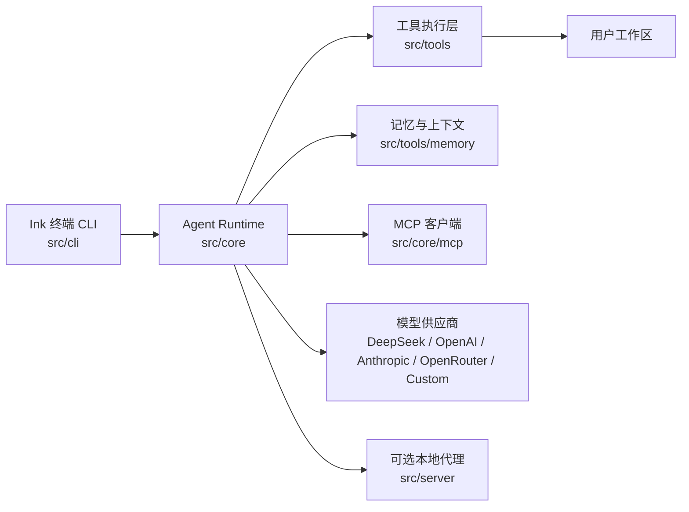
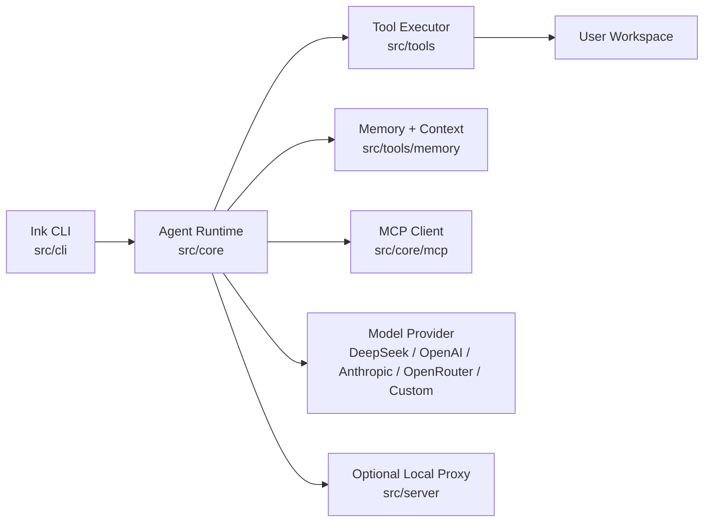

<p align="center">
  
</p>

<h1 align="center">TurboFlux CLI</h1>

<p align="center">
  本地优先的 AI 工作台，用于在真实项目中规划、阅读、修改、执行和恢复上下文。
  <br />
  A local-first AI workbench for planning, editing, command execution, checkpoints, and durable workspace context.
</p>

<p align="center">
  <a href="#中文文档">中文</a> ·
  <a href="#english">English</a>
</p>

<p align="center">
  
  
  
  
  
</p>

---

## 中文文档

### 项目定位

TurboFlux CLI 是一个本地 AI 工作台。它提供终端交互界面、共享 Agent Runtime、工具执行层、会话记忆、检查点历史、MCP 扩展和模型供应商配置能力。

TurboFlux 不绑定默认模型，也不要求先启动本地后端。首次使用时通过 `turboflux setup` 选择供应商并写入本机配置。

### 架构



### 安装

macOS / Linux / Git Bash：

```bash
curl -fsSL https://raw.githubusercontent.com/MengShengbo/TurboFluxCli/main/install.sh | bash
```

Windows PowerShell：

```powershell
irm https://raw.githubusercontent.com/MengShengbo/TurboFluxCli/main/install.ps1 | iex
```

从源码安装：

```bash
git clone https://github.com/MengShengbo/TurboFluxCli.git
cd TurboFluxCli
npm install
npm install -g .
```

### 配置模型

交互式配置：

```bash
turboflux setup
```

非交互配置：

```bash
turboflux setup --provider custom --api-key <your-api-key> --base-url https://api.example.com/v1 --model custom-model
turboflux setup --provider openai --api-key <your-api-key> --model gpt-5.5
turboflux setup --provider anthropic --api-key <your-api-key>
turboflux setup --provider openrouter --api-key <your-api-key>
turboflux setup --provider deepseek --api-key <your-api-key>
```

查看配置：

```bash
turboflux config show
```

### 使用

在指定项目中启动：

```bash
turboflux /path/to/project
```

在当前目录启动：

```bash
cd /path/to/project
turboflux
```

单次任务模式：

```bash
turboflux /path/to/project --command "summarize this repository"
```

### 交互命令

```text
/help                 查看命令
/setup                查看模型配置命令
/config               查看当前配置
/config apiKey VALUE  手动设置 API Key
/model                选择模型
/plan                 切换到计划/只读模式
/vibe                 切换到自主执行模式
/init                 创建 TURBOFLUX.md 项目指令
/resume               打开历史会话
```

### 可选本地代理

本地代理用于自建 OpenAI-compatible 转发和管理，不是必需组件。

```bash
npm run server
turboflux setup --provider local-proxy --yes
```

管理页面：

```text
http://127.0.0.1:8787/admin
```

### 目录结构

```text
bin/           CLI 启动入口
src/cli/       Ink 终端 UI、斜杠命令、会话存储
src/core/      Agent Runtime、模型配置、权限、MCP、Skills
src/server/    可选本地 OpenAI-compatible 代理和管理页面
src/state/     模型与共享状态契约
src/tools/     工具执行、本地历史、记忆工具
src/shared/    跨层共享类型
docs/assets/   README 与文档资源
```

### 开发

```bash
npm run dev:cli
npm run dev:server
npm run dev
npm run type-check
npm test
npm run build
```

### 安全

- API Key 存储在本机 `~/.turboflux/config.json`。
- 工具执行默认限制在工作区内。
- 高风险命令会在非 full-auto 策略下要求审批。
- `.env`、本地状态、构建产物、日志、临时文件和依赖目录不应入库。

---

## English

### What It Is

TurboFlux CLI is a local-first AI workbench for planning, editing, command execution, checkpoints, and durable workspace context.

TurboFlux does not bind to a default model provider. Run `turboflux setup` before the first model call.

### Architecture



### Install

macOS / Linux / Git Bash:

```bash
curl -fsSL https://raw.githubusercontent.com/MengShengbo/TurboFluxCli/main/install.sh | bash
```

Windows PowerShell:

```powershell
irm https://raw.githubusercontent.com/MengShengbo/TurboFluxCli/main/install.ps1 | iex
```

Manual source install:

```bash
git clone https://github.com/MengShengbo/TurboFluxCli.git
cd TurboFluxCli
npm install
npm install -g .
```

### Configure

```bash
turboflux setup
```

Non-interactive examples:

```bash
turboflux setup --provider custom --api-key <your-api-key> --base-url https://api.example.com/v1 --model custom-model
turboflux setup --provider openai --api-key <your-api-key> --model gpt-5.5
turboflux setup --provider anthropic --api-key <your-api-key>
turboflux setup --provider openrouter --api-key <your-api-key>
turboflux setup --provider deepseek --api-key <your-api-key>
```

### Use

```bash
turboflux /path/to/project
turboflux /path/to/project --command "summarize this repository"
```

### Optional Local Proxy

```bash
npm run server
turboflux setup --provider local-proxy --yes
```

Admin console:

```text
http://127.0.0.1:8787/admin
```

### Development

```bash
npm run dev:cli
npm run dev:server
npm run dev
npm run type-check
npm test
npm run build
```

### Safety

- API keys are stored locally in `~/.turboflux/config.json`.
- Workspace tool execution defaults to a workspace sandbox.
- High-risk commands require approval outside full-auto policy.
- Secrets, local state, build output, logs, temporary files, and dependencies should not be committed.

## License

MIT
