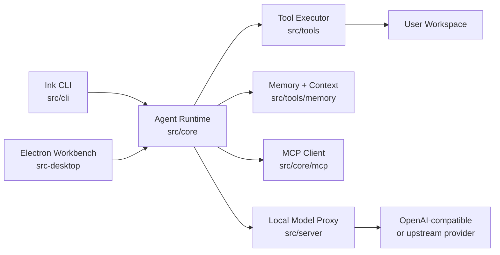

<p align="center">
  
</p>

<h1 align="center">TurboFlux CLI</h1>

<p align="center">
  A local AI workbench for turning workspace tasks into plans, edits, command runs, checkpoints, and durable context.
  <br />
  一个本地 AI 工作台：把工作区任务转成计划、代码修改、命令执行、检查点和可延续上下文。
</p>

<p align="center">
  <a href="#english">English</a> ·
  <a href="#中文">中文</a>
</p>

<p align="center">
  
  
  
  
  
  
</p>

---

## English

### What It Is

TurboFlux is an experimental local AI workbench. It combines a terminal CLI,
shared agent runtime, tool execution layer, memory utilities, checkpoint
history, optional Electron desktop shell, and a local OpenAI-compatible proxy.

It is designed for local developer workflows, not as a hosted SaaS backend.

### Highlights

- Terminal-native assistant built with Ink, including streaming output,
  slash commands, model picker, conversation history, rewind, and fixed
  viewport mode for terminals that flicker.
- Shared agent runtime with plan/vibe modes, task trees, context compaction,
  subagents, skills, MCP tools, and provider-aware model requests.
- Workspace sandbox for file and command tools, plus approval gates for
  destructive or high-risk operations.
- Local checkpoints and conversation storage for safer iteration.
- Local model proxy that keeps upstream API keys on the backend side.
- Optional Electron desktop workbench source under `src-desktop/`.

### Architecture



### Repository Layout

```text
bin/           CLI executable shim
src/cli/       Ink UI, slash commands, conversation storage
src/core/      Agent runtime, model config, permissions, MCP, skills
src/server/    Local OpenAI-compatible proxy and admin console
src/state/     Shared provider/model state contracts
src/tools/     Tool execution, local history, memory utilities
src/shared/    Cross-layer types
src-desktop/   Electron main/preload/renderer source
docs/assets/   README and documentation assets
```

### Requirements

- Node.js 20 or newer
- npm
- Optional: `rg` / ripgrep for faster search tools

### Quick Start

```bash
npm install
npm start
```

Run against a specific workspace:

```bash
npm start -- /path/to/project
```

Run a single prompt and exit:

```bash
npm start -- --command "summarize this repository"
```

Useful slash commands:

```text
/help                 list commands
/config               show current config
/config apiKey VALUE  set local proxy token or provider key
/model                pick a model preset
/plan                 switch to read/plan mode
/vibe                 switch to autonomous execution mode
/init                 create TURBOFLUX.md project instructions
/resume               open saved conversations
```

TurboFlux does not write `TURBOFLUX.md` automatically when the CLI starts. Use
`/init` when you want to create project instructions in the current workspace.

### Local Model Proxy

Default CLI config:

```text
baseUrl: http://127.0.0.1:8787
apiKey: turboflux-local
model: gpt-5.5
```

Start the proxy:

```bash
npm run server
```

Open the admin console:

```text
http://127.0.0.1:8787/admin
```

Create `.env` from `.env.example`:

```bash
TURBOFLUX_FREE_MODEL_API_KEY=<your-upstream-api-key>
TURBOFLUX_FREE_MODEL_BASE_URL=https://api.example.com/v1
TURBOFLUX_FREE_MODEL=gpt-5.5
```

If you bind the proxy outside localhost, set `TURBOFLUX_PROXY_AUTH_TOKEN`.
TurboFlux refuses non-localhost binds without that token.

### Development

```bash
npm run dev:cli        # watch CLI
npm run dev:server     # watch local proxy
npm run dev            # launch Electron development workbench
npm run type-check     # TypeScript check
npm test               # Vitest suite
npm run build          # compile src/
npm run build:desktop  # build Electron bundles
```

### Safety Notes

- Workspace tool execution defaults to a workspace sandbox. Absolute paths and
  `..` traversal outside the workspace are blocked unless explicitly configured
  for full access.
- High-risk commands such as force pushes, hard resets, recursive deletes, and
  database drops require approval outside full-auto policy.
- The local proxy redacts upstream API keys from admin responses.
- Secrets, local state, build output, logs, temporary files, reference dumps,
  and dependencies are ignored by Git.

---

## 中文

### 项目定位

TurboFlux 是一个实验性的本地 AI 工作台。它把终端 CLI、共享 Agent Runtime、工具执行层、记忆与上下文、检查点历史、可选 Electron 桌面壳，以及本地 OpenAI-compatible 模型代理组合在一起。

它更像开发者本地工具箱，而不是一个托管 SaaS 后端。

### 核心能力

- 基于 Ink 的终端助手：流式输出、斜杠命令、模型选择、会话历史、回退和固定视口模式。
- 共享 Agent Runtime：计划/执行模式、任务树、上下文压缩、子代理、Skills、MCP 工具和多模型请求适配。
- 工作区沙箱：文件和命令工具默认限制在工作区内，高风险操作需要审批。
- 本地检查点和会话存储，让迭代更安全。
- 本地模型代理：上游 API Key 留在后端，不直接放到 CLI 或桌面 UI。
- `src-desktop/` 内包含可选 Electron 桌面工作台源码。

### 目录结构

```text
bin/           CLI 启动入口
src/cli/       Ink 终端 UI、斜杠命令、会话存储
src/core/      Agent Runtime、模型配置、权限、MCP、Skills
src/server/    本地 OpenAI-compatible 代理和管理页
src/state/     模型和状态契约
src/tools/     工具执行、本地历史、记忆工具
src/shared/    跨层共享类型
src-desktop/   Electron main / preload / renderer
docs/assets/   README 和文档资源
```

### 快速开始

```bash
npm install
npm start
```

指定工作区：

```bash
npm start -- /path/to/project
```

单次任务模式：

```bash
npm start -- --command "summarize this repository"
```

常用命令：

```text
/help                 查看命令
/config               查看配置
/config apiKey VALUE  设置本地代理令牌或模型 Key
/model                选择模型
/plan                 切换到计划模式
/vibe                 切换到自主执行模式
/init                 创建 TURBOFLUX.md 项目指令
/resume               打开历史会话
```

CLI 启动时不会自动写入 `TURBOFLUX.md`。需要项目指令文件时手动执行 `/init`。

### 本地模型代理

默认配置：

```text
baseUrl: http://127.0.0.1:8787
apiKey: turboflux-local
model: gpt-5.5
```

启动代理：

```bash
npm run server
```

管理页：

```text
http://127.0.0.1:8787/admin
```

从 `.env.example` 创建 `.env`：

```bash
TURBOFLUX_FREE_MODEL_API_KEY=<your-upstream-api-key>
TURBOFLUX_FREE_MODEL_BASE_URL=https://api.example.com/v1
TURBOFLUX_FREE_MODEL=gpt-5.5
```

如果代理绑定到非 localhost，必须设置 `TURBOFLUX_PROXY_AUTH_TOKEN`，否则 TurboFlux 会拒绝启动。

### 开发命令

```bash
npm run dev:cli        # 监听 CLI
npm run dev:server     # 监听本地代理
npm run dev            # 启动 Electron 开发工作台
npm run type-check     # TypeScript 检查
npm test               # Vitest 测试
npm run build          # 编译 src/
npm run build:desktop  # 构建 Electron bundles
```

### 安全说明

- 默认工具执行限制在工作区内，除非显式切换到 full access。
- 强制推送、硬重置、递归删除、数据库 drop 等高风险命令需要审批。
- 本地代理不会在管理接口返回真实上游 Key。
- `.env`、本地状态、构建产物、日志、临时文件、参考资料和依赖目录都应保持不入库。

## Verification

```bash
npm run type-check
npm test
npm audit --audit-level=high --registry=https://registry.npmjs.org
```

Current snapshot: TypeScript passes, 259 tests pass, and npm audit reports 0
known vulnerabilities.

## License

MIT
