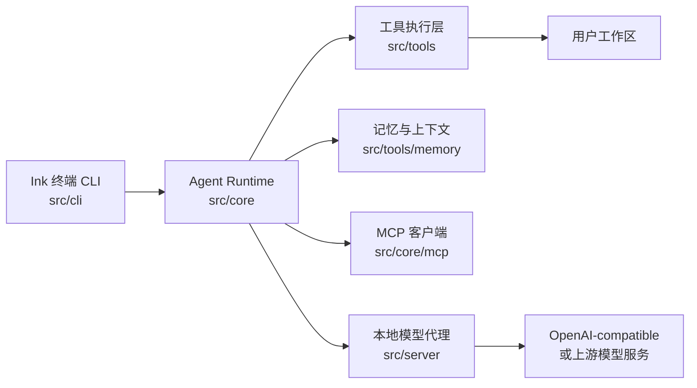
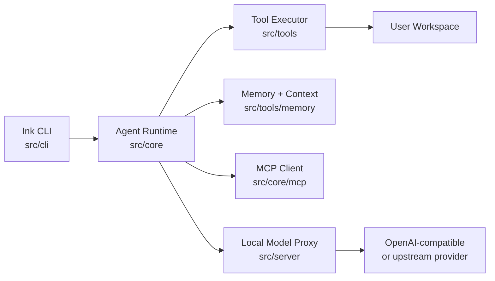

<p align="center">
  
</p>

<h1 align="center">TurboFlux CLI</h1>

<p align="center">
  一个本地 AI 工作台：把工作区任务转成计划、代码修改、命令执行、检查点和可延续上下文。
  <br />
  A local AI workbench for plans, edits, command runs, checkpoints, and durable workspace context.
</p>

<p align="center">
  <a href="#中文文档">中文</a> ·
  <a href="#english">English</a>
</p>

<p align="center">
  
  
  
  
  
</p>

---

## 中文文档

### 项目定位

TurboFlux CLI 是一个实验性的本地 AI 工作台。它把终端 CLI、共享 Agent Runtime、工具执行层、记忆与上下文、检查点历史，以及本地 OpenAI-compatible 模型代理组合在一起。

它更像开发者本机的工作流工具，而不是托管 SaaS 后端。核心目标是让 AI 能够在一个真实工作区里读代码、制定计划、执行命令、修改文件、保留上下文，并在必要时通过权限和检查点降低误操作风险。

> 当前开源仓库只包含 CLI 与本地代理相关源码，不包含桌面端源码。

### 系统架构



### 核心能力

- 终端原生体验：基于 Ink 构建，支持流式输出、斜杠命令、模型选择、历史会话、回退和固定视口模式。
- 共享 Agent Runtime：支持计划模式、执行模式、任务树、上下文压缩、子代理、Skills、MCP 工具和多模型请求适配。
- 工作区工具层：提供文件读写、命令执行、本地历史、记忆工具等能力，并带有沙箱与审批策略。
- 检查点与会话：本地保存对话和检查点，方便恢复、回退和审查。
- 本地模型代理：把上游 API Key 留在本地后端侧，CLI 和管理页面通过本地代理访问模型。

### 目录结构

```text
bin/           CLI 启动入口
src/cli/       Ink 终端 UI、斜杠命令、会话存储
src/core/      Agent Runtime、模型配置、权限、MCP、Skills
src/server/    本地 OpenAI-compatible 代理和管理页面
src/state/     模型与共享状态契约
src/tools/     工具执行、本地历史、记忆工具
src/shared/    跨层共享类型
docs/assets/   README 与文档资源
```

### 运行要求

- Node.js 20 或更新版本
- npm
- 可选：`rg` / ripgrep，用于更快的代码搜索

### 快速开始

```bash
npm install
npm start
```

指定工作区启动：

```bash
npm start -- /path/to/project
```

执行单次任务后退出：

```bash
npm start -- --command "summarize this repository"
```

常用斜杠命令：

```text
/help                 查看命令
/config               查看当前配置
/config apiKey VALUE  设置本地代理令牌或模型 Key
/model                选择模型
/plan                 切换到计划/只读模式
/vibe                 切换到自主执行模式
/init                 创建 TURBOFLUX.md 项目指令
/resume               打开历史会话
```

CLI 启动时不会自动写入 `TURBOFLUX.md`。需要项目指令文件时，手动执行 `/init`。

### 本地模型代理

默认 CLI 配置：

```text
baseUrl: http://127.0.0.1:8787
apiKey: turboflux-local
model: gpt-5.5
```

启动代理：

```bash
npm run server
```

打开管理页面：

```text
http://127.0.0.1:8787/admin
```

从 `.env.example` 创建 `.env`：

```bash
TURBOFLUX_FREE_MODEL_API_KEY=<your-upstream-api-key>
TURBOFLUX_FREE_MODEL_BASE_URL=https://api.example.com/v1
TURBOFLUX_FREE_MODEL=gpt-5.5
```

如果代理绑定到非 localhost 地址，必须设置 `TURBOFLUX_PROXY_AUTH_TOKEN`。没有该 token 时，TurboFlux 会拒绝非本机绑定，避免代理被误暴露。

### 开发命令

```bash
npm run dev:cli        # 监听 CLI
npm run dev:server     # 监听本地代理
npm run dev            # 默认等同于 dev:cli
npm run type-check     # TypeScript 检查
npm test               # Vitest 测试
npm run build          # 编译 src/
```

### 安全设计

- 默认工具执行限制在工作区内，绝对路径和 `..` 穿越会被拦截，除非显式配置为 full access。
- 强制推送、硬重置、递归删除、数据库 drop 等高风险命令会在非 full-auto 策略下要求审批。
- 本地代理不会在管理接口中返回真实上游 API Key。
- `.env`、本地状态、构建产物、日志、临时文件、参考资料和依赖目录都应保持不入库。

### 验证命令

```bash
npm run type-check
npm test
npm audit --audit-level=high --registry=https://registry.npmjs.org
```

---

## English

### What It Is

TurboFlux CLI is an experimental local AI workbench. It combines a terminal CLI, shared agent runtime, tool execution layer, memory utilities, checkpoint history, and a local OpenAI-compatible proxy.

It is designed for local developer workflows rather than a hosted SaaS backend.

> This public repository contains CLI and local proxy source only. Desktop source is not included.

### Architecture



### Highlights

- Terminal-native assistant built with Ink, including streaming output, slash commands, model picker, conversation history, rewind, and fixed viewport mode.
- Shared agent runtime with plan/vibe modes, task trees, context compaction, subagents, skills, MCP tools, and provider-aware model requests.
- Workspace sandbox for file and command tools, plus approval gates for destructive or high-risk operations.
- Local checkpoints and conversation storage for safer iteration.
- Local model proxy that keeps upstream API keys on the backend side.

### Repository Layout

```text
bin/           CLI executable shim
src/cli/       Ink UI, slash commands, conversation storage
src/core/      Agent runtime, model config, permissions, MCP, skills
src/server/    Local OpenAI-compatible proxy and admin console
src/state/     Shared provider/model state contracts
src/tools/     Tool execution, local history, memory utilities
src/shared/    Cross-layer types
docs/assets/   README and documentation assets
```

### Requirements

- Node.js 20 or newer
- npm
- Optional: `rg` / ripgrep for faster search tools

### Quick Start

```bash
npm install
npm start
```

Run against a specific workspace:

```bash
npm start -- /path/to/project
```

Run a single prompt and exit:

```bash
npm start -- --command "summarize this repository"
```

### Local Model Proxy

```bash
npm run server
```

Admin console:

```text
http://127.0.0.1:8787/admin
```

Create `.env` from `.env.example`:

```bash
TURBOFLUX_FREE_MODEL_API_KEY=<your-upstream-api-key>
TURBOFLUX_FREE_MODEL_BASE_URL=https://api.example.com/v1
TURBOFLUX_FREE_MODEL=gpt-5.5
```

If the proxy binds outside localhost, set `TURBOFLUX_PROXY_AUTH_TOKEN`.

### Development

```bash
npm run dev:cli
npm run dev:server
npm run dev
npm run type-check
npm test
npm run build
```

### Safety Notes

- Workspace tool execution defaults to a workspace sandbox.
- High-risk commands such as force pushes, hard resets, recursive deletes, and database drops require approval outside full-auto policy.
- The local proxy redacts upstream API keys from admin responses.
- Secrets, local state, build output, logs, temporary files, reference dumps, and dependencies are ignored by Git.

## License

MIT
