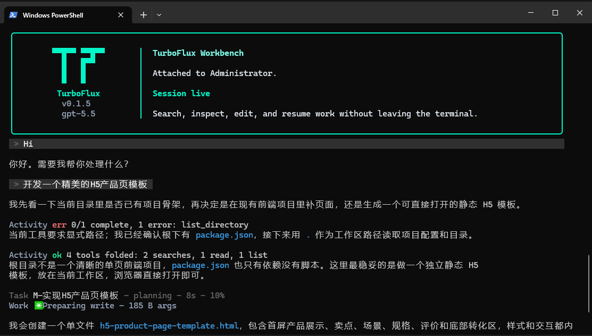

<p align="center">
  
</p>

<h1 align="center">TurboFlux CLI</h1>

<p align="center">
  一个在真实工作区里读代码、改文件、跑命令的终端 AI Agent。
</p>

<p align="center">
  
  
  
  
</p>

TurboFlux 是我给自己做的终端 AI 编程 Agent。目标不是把聊天框搬进 CLI，而是让模型能在一个真实项目里连续完成检索、阅读、修改、命令执行和验证，并把会话、上下文与恢复信息留在本机。

当前版本是 **0.1.5**。项目可以日常使用，但仍在快速开发，配置格式、交互细节和扩展接口都可能变化。

<p align="center">
  
</p>

## 快速开始

需要 Node.js 20 或更高版本。Git 不是启动必需项；如果工作区本身是 Git 仓库，TurboFlux 会在会话开始时默认启用 Git 集成。

```bash
npm install -g github:MengShengbo/TurboFluxCli
turboflux setup
turboflux /path/to/project
```

从源码安装：

```bash
git clone https://github.com/MengShengbo/TurboFluxCli.git
cd TurboFluxCli
npm install
npm install -g .
```

在当前目录启动，或者执行一次性任务：

```bash
turboflux
turboflux . --command "找出登录流程的入口，并说明调用链"
```

`turboflux setup` 会配置 API、模型、界面与输出语言、人设和全局指令。TurboFlux 不附带免费模型或 API Key。

## 现在能做什么

| 能力 | 当前实现 |
| --- | --- |
| 读写代码 | 分段或整文件读取、精确编辑、原子多处编辑、创建与删除文件，并在终端里展示变更状态和 diff |
| 搜索项目 | 文件名搜索、正则内容搜索、轻量符号扫描、项目 codemap，以及 FastContext 多轮检索 |
| 执行命令 | 前台命令、后台终端、增量读取输出、列出与停止后台进程 |
| 处理长任务 | 任务树、依赖关系、进度状态、子代理，以及连续工具调用 |
| 保存工作现场 | 本地会话自动保存、历史会话恢复、双击 `Esc` 回到某条用户消息之前 |
| 管理上下文 | 使用供应商返回的 token 用量，在长会话中做 recap、自动压缩和手动压缩 |
| 接收图片 | Windows 终端中直接粘贴剪贴板图片，也可以粘贴本地图片路径 |
| 扩展能力 | 项目/用户 Skills、项目自定义 Agents、stdio MCP 工具 |

这些能力不是 README 里的规划项，入口都在 `src/cli`、`src/core` 和 `src/tools` 中。尚未完成的部分单独写在后面的“当前边界”里。

## FastContext

FastContext 是 TurboFlux 的代码定位子代理，不是 `/fastcontext` 斜杠命令。

当主 Agent 判断一次普通搜索不够时，可以调用 `explore_code`，或者通过 `spawn_agent` 启动 `fast_context`。它在独立上下文中使用一组只读工具：

```text
search_content
search_files
search_symbols
read_file
get_codemap
```

一次扫描默认最多 3 轮，每轮最多并发 6 个工具调用。结果不是整段搜索过程，而是一份压缩后的候选文件、行号、证据类型和置信度列表。主 Agent 再按这份地图读取真正相关的源码，避免把大量检索噪声塞进主会话。

FastContext 默认跟随主模型，也可以单独分配一个更快或更便宜的 API 配置：

```bash
turboflux setup fastcontext
```

## 图片输入

在 Windows 交互终端里，复制截图后按 `Ctrl+V`，输入框会插入 `[Image #1]`，图片作为附件随下一条消息发送。连续粘贴可以附加多张图片。

也可以直接粘贴图片路径或 Markdown 图片引用。这种方式不依赖 Windows 剪贴板：

```text
帮我看一下这个报错截图：C:\Users\me\Desktop\error.png
对比 ./before.png 和 ./after.png
```

当前单张图片上限为 5 MB。PNG、JPEG、WebP 和 GIF 可以直接进入视觉模型请求；最终能否识图仍取决于所选模型和 API 是否支持视觉输入。

## 会话与上下文

会话保存在 `~/.turboflux/conversations/`。`/resume` 会打开历史选择器，`Ctrl+H` 也能进入同一界面。输入框为空时连续按两次 `Esc`，可以选择一条旧的用户消息，把会话退回到它之前并重新编辑。

上下文管理分两层：

1. 达到较早阈值时生成 cache-safe recap，保留当前任务、文件、错误、验证结果和下一步。
2. 接近模型输入上限时压缩旧轮次，保留最近对话和工具证据；模型摘要失败时会退回结构化本地摘要。

`/context` 显示最近一次供应商返回的输入/输出 token，`/compact` 手动触发压缩。TurboFlux 不用字符估算冒充供应商 token 用量，因此模型没有返回 usage 时会明确显示 unknown。

项目规则和长期记忆会按当前问题筛选后注入。除了 `TURBOFLUX.md`，还兼容读取 `CLAUDE.md`、`AGENTS.md`、`.cursorrules`、`.cursor/rules/`、`.windsurfrules` 等常见规则文件。

## 常用命令

在会话中输入 `/help` 可以看到当前版本实际注册的全部命令。

| 命令 | 作用 |
| --- | --- |
| `/model` | 打开模型选择器或切换模型 |
| `/plan` | 先检索和规划，得到确认后再执行 |
| `/vibe` | 进入自主执行模式 |
| `/thinking auto\|off\|standard\|max` | 调整推理模式 |
| `/context` | 查看供应商上报的上下文用量 |
| `/compact` | 压缩较早的对话 |
| `/resume` | 恢复已保存的会话 |
| `/list` | 列出会话 |
| `/new` | 开始新会话 |
| `/clear` | 保存当前会话后清空界面并开始新会话 |
| `/mcp status\|tools` | 查看 MCP 连接和工具 |
| `/skills` | 查看已加载的 Skill |
| `/git on\|off` | 开关当前会话的 Git 状态注入和 Git checkpoint |

注意：Git 仓库默认会启用这项集成。Agent 调用显式 `create_checkpoint` 时会执行 `git add -A` 和 `git commit`，其中 `git add -A` 会暂存工作区的全部改动，而不只包含 Agent 刚修改的文件；它不会自动 push。工作区里有不想提交的改动时，应在当前会话先执行 `/git off`。

## 模型与 API

TurboFlux 对 Anthropic 使用 Messages API；OpenAI、OpenRouter、DeepSeek 和自定义服务走 OpenAI-compatible Chat Completions。可以保存多份 API 配置，并给主 Agent 与 FastContext 分配不同配置。

```bash
turboflux setup api
turboflux setup show
```

内置模型表只提供模型名、上下文窗口、输出上限和推理参数等元数据。它不代表你的账号一定拥有对应模型权限，实际可用性由 API 供应商决定。自定义 OpenAI-compatible 服务可以直接填写 Base URL 和模型名。

主要本机配置：

```text
~/.turboflux/config.json          API、模型和 FastContext 配置
~/.turboflux/profile.json         语言、人设和全局自定义指令
~/.turboflux/conversations/       会话记录
~/.turboflux/checkpoints/         本地文件 checkpoint 数据
```

API Key 当前以明文 JSON 保存在本机配置中，没有接入系统钥匙串。

## Skills、Agents 与 MCP

Skill 使用一个带 frontmatter 的 `SKILL.md`：

```text
<workspace>/.turboflux/skills/<name>/SKILL.md
~/.turboflux/skills/<name>/SKILL.md
```

同名时项目 Skill 优先。加载后会注册成斜杠命令，并把 Skill 指令附加到 Agent。

自定义子代理从下面的位置加载：

```text
<workspace>/.turboflux/agents/*.md
```

MCP 配置支持项目级和全局级文件，项目配置优先：

```text
<workspace>/.turboflux/settings.json
~/.turboflux/settings.json
```

当前 MCP 只实现了 stdio transport。最小配置如下：

```json
{
  "mcpServers": {
    "example": {
      "command": "node",
      "args": ["path/to/server.js"],
      "enabled": true
    }
  }
}
```

## 安全与当前边界

- 文件工具会拒绝工作区之外的路径，但这不是容器或操作系统级隔离。`run_command` 仍然是在本机 Shell 中执行。
- 权限管线会拒绝磁盘级破坏命令，并对 `git reset --hard`、`git clean -f`、递归删除、强推等高风险命令请求确认。规则匹配不可能覆盖所有危险命令，确认框仍需要人看。
- 文件修改后会自动写入本地 checkpoint，但当前 CLI 还没有完整的 checkpoint 浏览和恢复界面。它不能替代 Git、远程仓库或正式备份。
- 剪贴板位图捕获目前只支持 Windows；粘贴本地图片路径可跨平台使用。
- MCP 目前只有 stdio transport，自定义 Agent 的格式和模型路由仍在调整。
- `src/server/` 是实验性的本地兼容 API 与管理页，不是 CLI 默认启动路径，也暂不作为稳定功能发布。

## 源码结构

```text
bin/                    turboflux 启动入口
src/cli/                Ink 界面、输入、命令、会话与图片附件
src/core/               Agent 循环、模型调用、上下文、权限、子代理与 MCP
src/core/runtime/       CLI 使用的状态和本地工具执行器
src/tools/              工具接口、本地历史和工作区记忆
src/shared/             跨模块类型与协议
src/server/             实验性本地 API 代理和管理页
```

## 开发

```bash
npm install
npm run dev:once -- .
npm test
npm run type-check
npm run build
```

测试使用 Vitest，TypeScript 编译目标为 ES2022。

## License

MIT
